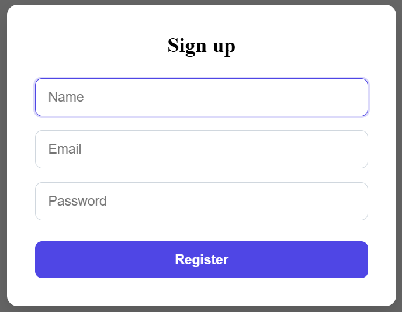

# React Auth Dashboard (Radix UI)

## Screenshots
<p align="center">
  
  
</p>

A modern React authentication dashboard built with **React 19**, **TypeScript**, **Vite**, **React Router**, and **Radix UI**.  
This project demonstrates authentication flow using **Context API**, **custom hooks**, **protected routes**, and **localStorage persistence**.

---

## ✨ Features

- 🔐 Authentication with Context API
- 💾 User session persistence using `localStorage`
- 🧭 Protected routes with React Router
- 🧱 Modular architecture (hooks, context, pages, components)
- 🎨 UI primitives powered by **Radix UI**
- ⚡ Fast development with Vite + SWC
- 🧼 ESLint + TypeScript strict setup

---

## 🧰 Tech Stack

- **React 19**
- **TypeScript**
- **Vite**
- **React Router DOM**
- **Radix UI**
- **CSS Modules / Plain CSS**
- **Context API + Custom Hooks**

---

## 📦 Dependencies

```json
"dependencies": {
  "@radix-ui/react-avatar": "^1.1.11",
  "@radix-ui/react-dialog": "^1.1.15",
  "@radix-ui/react-dropdown-menu": "^2.1.16",
  "react": "^19.2.0",
  "react-dom": "^19.2.0",
  "react-router-dom": "^7.13.0"
}

"devDependencies": {
  "@eslint/js": "^9.39.1",
  "@types/node": "^24.10.1",
  "@types/react": "^19.2.5",
  "@types/react-dom": "^19.2.3",
  "@vitejs/plugin-react-swc": "^4.2.2",
  "eslint": "^9.39.1",
  "eslint-plugin-react-hooks": "^7.0.1",
  "eslint-plugin-react-refresh": "^0.4.24",
  "globals": "^16.5.0",
  "typescript": "~5.9.3",
  "typescript-eslint": "^8.46.4",
  "vite": "^7.2.4"
}
```
---
### 🚀 Getting Started

### 1. Clone the repository

```bash
git clone https://github.com/LizardoReyes/react-auth-dashboard.git
cd react-auth-dashboard
```

### 2. Install dependencies
```bash
npm install
```

### 3. Start the development server
```bash
npm run dev
```

The app will be available at:

```bash
http://localhost:5173
```
---
### 🗂️ Project Structure

```bash
src/
│
├── components/       # Navbar, UI components
├── context/          # AuthContext & Provider
├── hooks/            # useAuth custom hook
├── pages/            # Login, Register, Dashboard
├── routes/           # Router & protected routes
├── styles/           # CSS files
├── data/             # Mock users
├── App.tsx
└── main.tsx
```